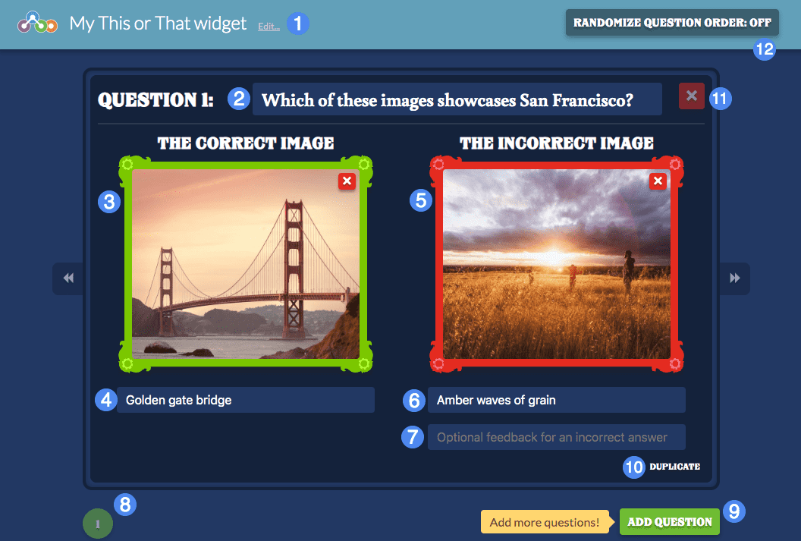

# Creator Guide #

## Overview ##

This or That tasks students with selecting the correct image in response to a question. Images are provided in pairs with a correct choice and an incorrect choice. You can provide optional feedback should the student select the incorrect image.

1. Widget title
2. Question text
3. Correct image
4. Optional label/alt text
5. Incorrect image
6. Optional label/alt text
7. Optional feedback for incorrect answer
8. Question pagination controls
9. Add a new question
10. Duplicate this question
11. Delete this question
12. Randomize the ordering of questions

## Details ##

Upon initializing the creator, you will be prompted to provide a title for your widget, and can also opt out of the tutorial if desired. The tutorial will walk you through entering the question text, correct and incorrect images, and labels.

Note that labels are not visible to the user - they are intended primarily for accessibility purposes when the widget is played using a screenreader.

By default, questions will be ordered based on their arrangement in the creator - if you wish to randomize the ordering of questions when played, select the **Randomize Question Order** toggle on the top-right.
