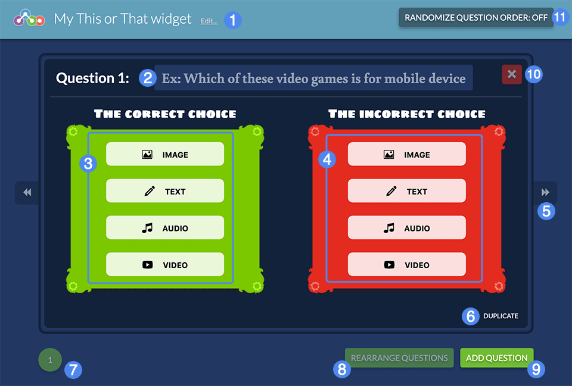
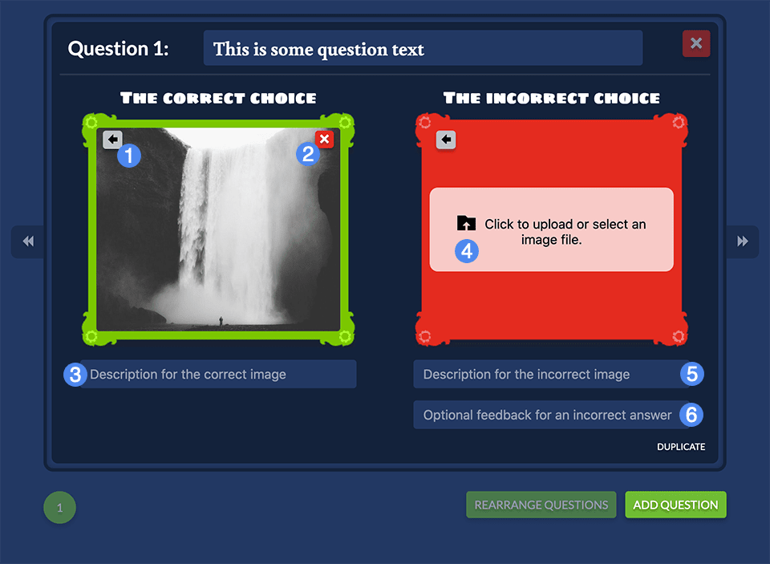
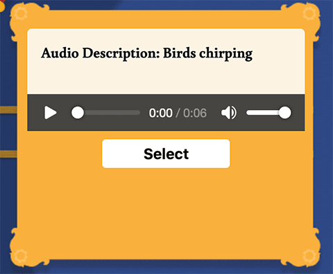
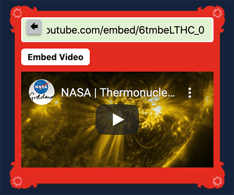

# Creator Guide #

## Overview ##

This or That tasks students with selecting the correct option in response to a question. Answer options are provided in pairs with a correct choice and an incorrect choice. You can provide optional feedback should the student select the incorrect option.

## Details ##

1. Widget title
2. Question text
3. Correct answer type selection 
4. Incorrect answer (with image selected)
5. Paginate between questions
6. Description (alt text) and optional feedback for incorrect choice
7. Duplicate question
8. Question selection
9. Rearrange the order of questions
10. Add another question
11. Delete this question
12. Question bank feature
13. Randomize questions toggle

Upon initializing the creator, you will be prompted to provide a title for your widget, and can also opt out of the tutorial if desired. The tutorial will walk you through entering the question text, correct and incorrect answer options, and option descriptions.

Note that the correct and incorrect description text is normally not visible to the user - they are intended primarily for accessibility purposes when the widget is played using a screenreader.

By default, questions will be ordered based on their arrangement in the creator. If you wish to randomize the ordering of questions when played, select the **Randomize Question Order** toggle on the top-right. _Note that when the Question Bank feature is enabled, questions will always be randomized. See the Question Bank section below._

### Answer Options ###

For each question, you must select the answer type for both the correct and incorrect options. The answer types can be different between each pair.

1. Choose a different answer type
2. Clear the selected media
3. Correct answer choice description
4. Prompt to upload media for the selected answer choice (only for image and audio answer types)
5. Incorrect answer choice description
6. Optional feedback if the incorrect choice is selected

The example above is using images for both answer types. The other answer types are functionally similar, with two notable differences:

For **audio** choices, the description text is visible alongside the audio controls: this is included so that users who are deaf or hard of hearing can be made aware of the audio content. *Note: the image below shows the audio description in the player.*

**Video**, if selected, will provide an input box in which you can paste a YouTube or Vimeo URL. Most permutations of these URLs are accepted. When successfully embedded, a player will be visible with a preview of the embedded video.

### Question Bank ###

When enabled, the question bank feature will select a subset of the questions you have authored at random every time a new play is initialized. You can adjust the size of the subset up to the maximum question count. For example, if you create 10 questions, and enable the question bank with 6 questions, the widget will select 6 questions out of the 10 at random whenever a student interacts with your widget. Note that the randomize toggle will be force-enabled when the question bank is turned on, because the question bank feature supersedes it.

