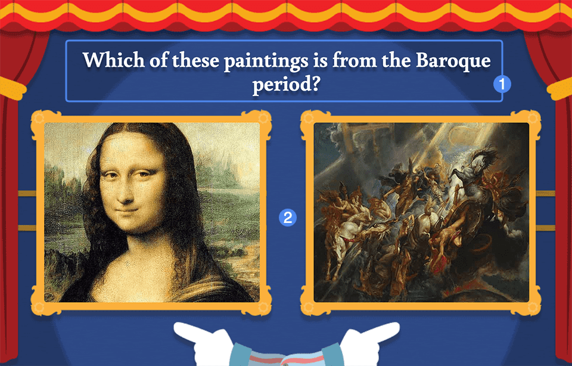
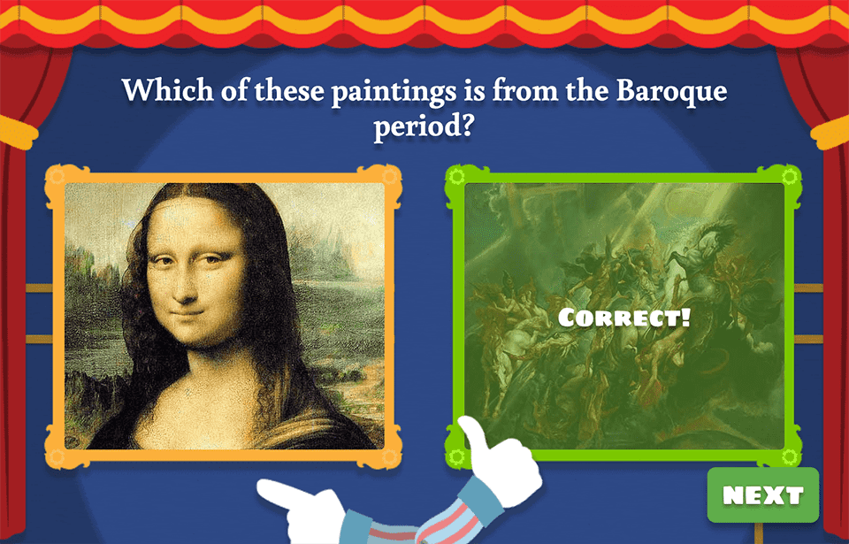
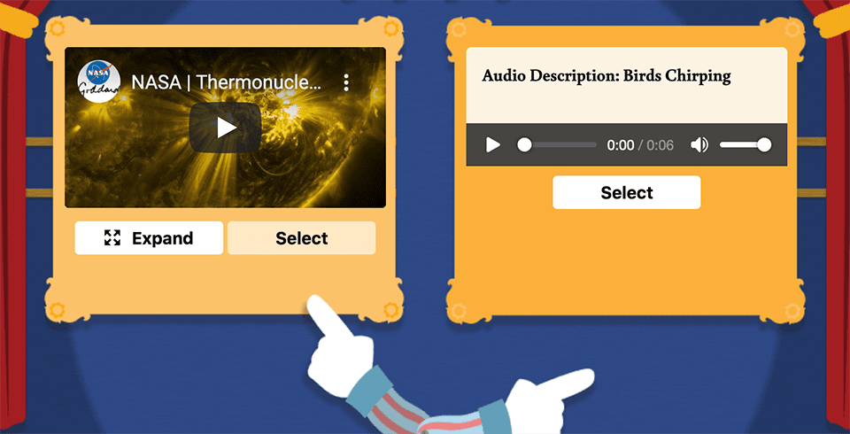

# Player Guide #

## Overview ##

This or That tasks students with selecting the correct option in response to a question. Options are provided in pairs with a correct choice and an incorrect choice. Options can be an **image**, **plain text**, **audio** (with accompanying description), and **video**.

1. Question text
2. Image response pair

## Details ##

Students are informed whether their choice was correct immediately upon selecting an option. If the incorrect option was selected, there may be feedback accompanying the selection. Once an image is selected, the student is prompted to continue by pressing the "Next" button.

Embedded video and audio options include several additional controls. For video, use the **expand** button to load the embedded video in a larger window. With both options, you can click on the controls to play the embedded content and confirm your choice by clicking the **Select** button.

