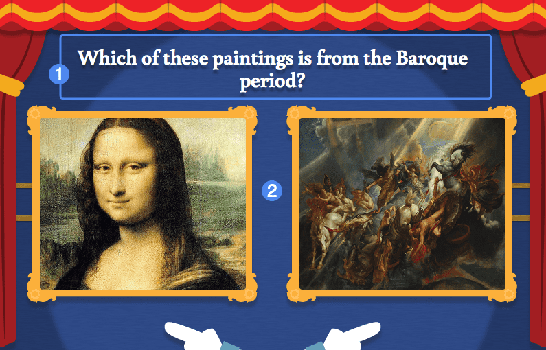
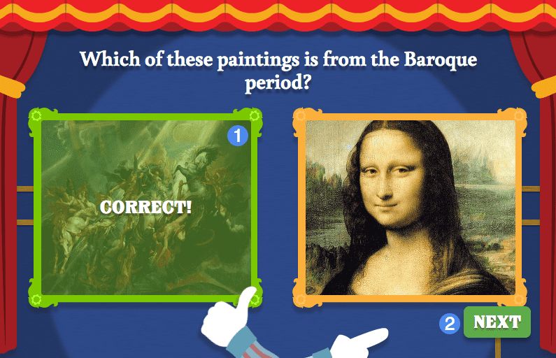

# Player Guide #

## Overview ##

With This or That, students must select the correct image based on the question provided. Two images are provided with each question; optional feedback may be provided if the incorrect image is selected.

1. Question text
2. Image response pair

## Details ##

Students are informed whether their choice was correct immediately upon selecting an image. If the incorrect image was selected, there may be feedback accompanying the selection.

1. Select image (correct)
2. Next button

Once an image is selected, the student is prompted to continue by pressing the "Next" button.